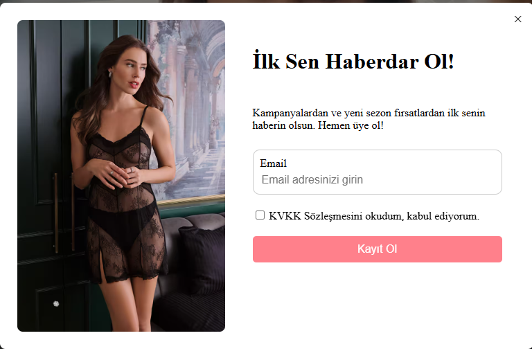
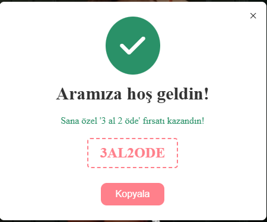
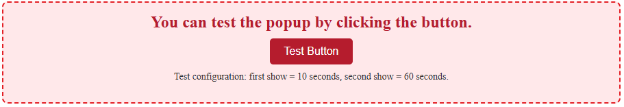

# PersonaClick – Technical Study Case

This project is a **technical study case prepared for PersonaClick**.
It includes a technical questionnaire and practical implementations developed
using **HTML, CSS, and Vanilla JavaScript**.

All solutions are available in the GitHub repository and implemented
directly in the source code.

---

## 📝 Technical Questionnaire

As part of the study case, **5 technical questions** were provided to assess
JavaScript fundamentals, DOM manipulation, and browser storage knowledge.

Each question has its own implementation in the repository.

---

### 1️⃣ You have a button on the page. 

- How can you select this button using JavaScript?
- How would you show an alert when the button is clicked?

---

### 2️⃣ You receive some text from JavaScript and want to show it on the page.

- How can you change the text of an HTML element using JavaScript?
- What is the difference between `innerText` and `innerHTML`?

---

### 3️⃣ You have an array of product names. 

- How do you loop through an array in JavaScript?
- How would you print each product name to the console?

---

### 4️⃣ You want to check if a user is logged in. 

- How would you write a simple `if` statement?
- What values are treated as `false` in JavaScript conditions?

---

### 5️⃣ You want to save a user’s name so it is still available after refreshing the page. 

- Which browser storage would you use?
- How would you save and read this value?
---
---
## ⏱️ Timed Campaign Popup – Practical Task

As part of the PersonaClick study case, a **Timed Campaign Popup** was implemented
using **HTML, CSS, and Vanilla JavaScript only**, following all given rules and
technical requirements.

---

### 📋 Task Description

A campaign popup system was created with the following behavior:

- The popup appears **after the user stays on the page for 10 seconds**
- After being shown **for the first time**, it does **not appear again immediately**
- The popup appears **one more time after 2 hours**
- After being shown **for the second time**, it is **never shown again**

---

### ⚙️ Technical Requirements & Implementation

- ✅ **Vanilla JavaScript only** (no frameworks or libraries)
- ✅ **HTML & CSS** used for structure and styling
- ✅ **localStorage** is used to persist popup state and timing
- ✅ Popup logic **persists after page refresh or browser restart**
- ✅ Popup content is **static**
- ✅ Popup is **dismissible** via a close button

---

### 🧠 Popup Logic Overview

The popup behavior is controlled using timestamps stored in `localStorage`:

- The **first visit time** is stored when the popup is shown for the first time
- A **second display time** is calculated based on a 2-hour delay
- A **display counter** ensures the popup is shown **only twice**
- Once the second popup is shown, a flag is saved to **prevent future displays**

This ensures that the popup timing remains consistent even after
page refreshes or browser restarts.

---

### 🎁 Campaign Flow

- On the **first popup**, the user is invited to participate in the campaign
- If the user **submits their email and registers**, the second popup displays
  a **reward / gift code**
- If the user does not register, the popup logic still respects the timing rules

---
### 🎨 Popup Designs

The project includes **two different popup designs**, depending on the user action:

#### 🖼️ Popup Design 1 – Initial Campaign Popup
- Displayed on first eligible visit
- Invites the user to join the campaign
- Contains email input and close button



---

#### 🖼️ Popup Design 2 – Reward Popup
- Displayed after successful email registration
- Shows the **gift / discount code**
- Appears only once based on popup rules



---

```text
10s wait
 ↓
Popup 1
 ↓
Email entered?
 ├─ Yes → Popup 2 (instant)
 │        ↓
 │     Copy the campaign code
 │        │ 
 └─ No    │ 
     ↓    ↓ 
   Close popup
     ↓
   Wait 2 hours
     ↓
Email exists?
 ├─ Yes → Popup 2
 └─ No  → Popup 1
     ↓
END (after second show)
````
---

## 🧪 Test Configuration & Popup Designs

Since **2 hours is a long duration to test**, an additional **test configuration**
was implemented to make the popup behavior easier and faster to verify during development.

---

### ⚙️ Test Mode Configuration

A **Test Mode button** was added on the main page to simulate the popup timing
with shorter intervals:

- ⏱️ **First popup display:** 10 seconds  
- ⏱️ **Second popup display:** 60 seconds  

This allows the full popup logic to be tested quickly without waiting for 2 hours.

> ℹ️ **Important:**  
> If the test button is **not clicked**, the system follows **all original
> requirements exactly**:
>
> - First popup after **10 seconds**
> - Second popup after **2 hours**
> - Popup is shown **only twice**
> - Logic persists after refresh or browser restart

This approach keeps the production logic intact while providing a
developer-friendly testing workflow.

---


### 🖼️ Test Mode Screenshot

The screenshot below shows the **Test Mode button** on the main page,
used to activate the shorter popup timing for testing purposes:




